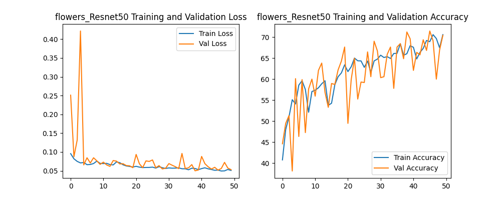
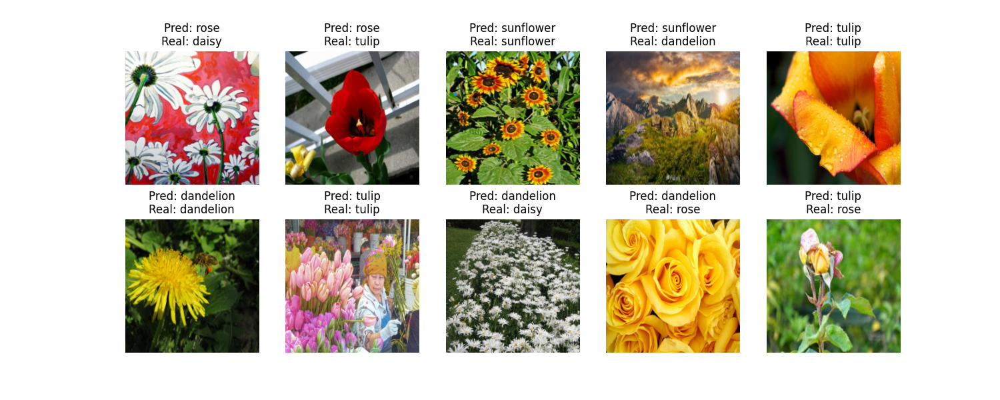
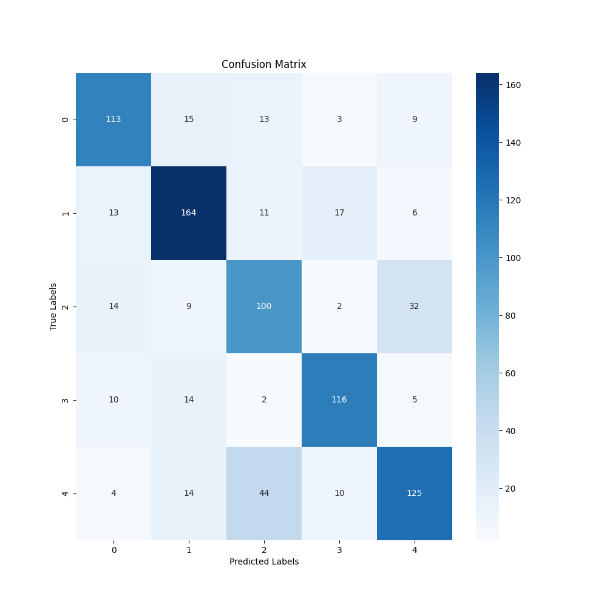
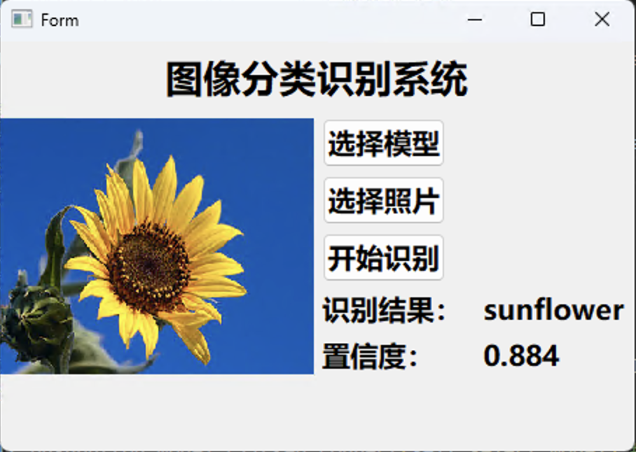
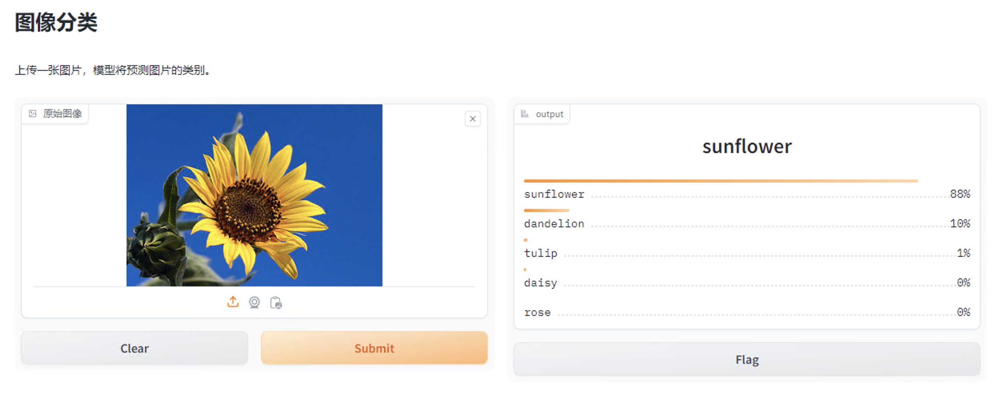

# Image_Classfication_Pytorch

## Dataset_process

将数据集按照以下格式处理好放入datasets

数据集名称

​	类别1

​	类别2

​	...

```
python dataset_process.py
```

数据集就按8:2的比例分成训练集和验证集

# Train

```
python train.py --model_name Resnet50 --dataset_name CIFAR100 --pretrain True --epochs 20
```

* --model_name 模型名称 目前支持Resnet50、EfficientNet、densenet169、vgg16、mobilenet_v3_small、vgg19、vit
* --dataset_name 数据集名称 目前支持CIFAR10、StanfordCars、Food101、CIFAR100和自定义数据集
* --pretrain 是否使用预训练模型
* --epochs 迭代次数 一般使用预训练模型可以减少迭代次数

每一次迭代都保存正确率和损失，最后画图如下：



# Predict

```
python predict.py
```

取10张照片进行预测，并将结果保存为图片



# Evaluate

```
python evaluate.py
```

构造混淆矩阵



# Qt

```
python qt.py
```

使用Pyqt5来构造可视化界面



# Web

```
python web.py
```

使用Gradio来构造Web界面

